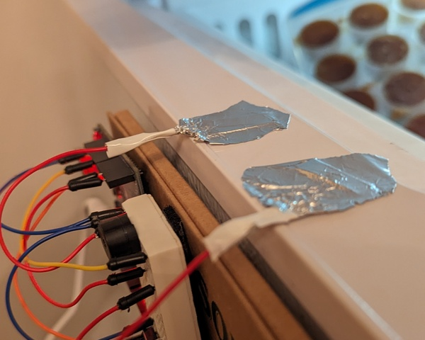
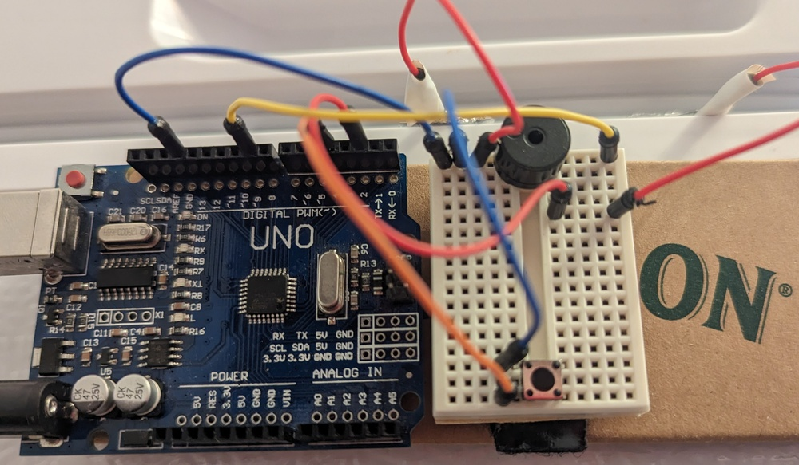

# keep-close

`keep-close` is an Arduino Uno alarm system that blares when the door is open for too long. It's great to put on your freezer, front door, secret drawer or anything that shouldn't be open for more than a few seconds.

The project is build in Rust for the _Arduino Uno_ using [`avr-hal`]. In the future it could be ported to an _Arduino Nano_ as it seems more suited for the job.

## Features

- [x] Detect when door is opened
- [x] Detect when door is opened for too long
- [x] Buzzer sound when door is opened for too long
- [ ] Option to use active buzzer
- [ ] Play melody on door open
- [x] Physical implementation
- [x] Disable button
- [ ] Statistics logging (Wi-Fi?)

### Open Detection

The state of the freezer door is detected by 3 pieces of copper tape (or aluminum foil with electrical tape). Two of which are connected to the micro-controller and placed on the freezer wall while the third piece is placed on the door and bridges the connection when the door is closed.

This method of door detection is cheap, reliable, and nondestructive to the freezer. The system can be easily modified to use a different method such as a reed switch, Hall effect sensor, or proximity sensor. The one downside that I have found for the copper tape method is that, aesthetically speaking, it does not look very polished. Although this could be an upside :).

## Build Instructions

*[support](#nix-build) for Nix*.

1. Install prerequisites as described in the [`avr-hal` README] (`avr-gcc`, `avr-libc`, `avrdude`, [`ravedude`]).

2. Run `cargo build` to build the firmware.

3. Run `cargo run` to flash the firmware to a connected board.  If `ravedude` fails to detect your board, check its documentation at <https://crates.io/crates/ravedude>.

4. `ravedude` will open a console session after flashing where you can interact
   with the UART console of your board.

[`avr-hal`]: https://github.com/Rahix/avr-hal
[`avr-hal` README]: https://github.com/Rahix/avr-hal#readme
[`ravedude`]: https://crates.io/crates/ravedude

### Nix Build

Simply `nix develop` to open a shell with dependencies. Steps 2-4 are the same as [above](#build-instructions).

## Hardware

| Item                                | Used for |
|-------------------------------------|-----|
| Arduino Uno                         | 🧠 |
| Breadboard                          | Electronics |
| Copper Tape OR Aluminum Foil + Tape | Detect door open |
| Passive buzzer                      | Sound/Melodies |
| Button                              | Disable buzzer |

**Pin 2** is connected to a piece of copper tape on the side of the freezer and should be in **input pull-up mode**. Another piece of copper tape is placed ~1 inch away from the first copper tape and connected to group. On the door, a long piece of copper tape is placed so that when the door is closed the two copper tapes are bridged, completing the circuit.

**Pin 9** is connected to the buzzer for PWM under Timer 1 (`OC1A`).

This is a picture of the (messy) system.

